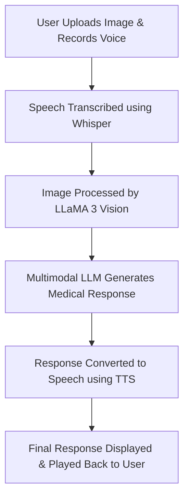

# 🤖 AI Doctor (Vision & Voice) - Medical Chatbot with MultiModal LLM 🏥  

[](https://youtu.be/yS9xVH0iYYQ)  
[](https://www.python.org/)  
[](https://gradio.app/)  

---

## 🚀 **Meet My AI Doctor!** 🏥🧑‍⚕️  
An **AI-powered medical chatbot** that can **see and hear** just like a real doctor! This intelligent assistant processes **images and voice input**, analyzes them using **state-of-the-art AI models**, and responds with **accurate medical guidance**—all through a **simple and interactive UI**.  

## 📌 **What This AI Doctor Can Do?**  
✅ **Upload an image** related to your health concern for AI analysis.  
✅ **Ask health-related questions** using voice input.  
✅ **Speech-to-Text conversion** to analyze patient queries.  
✅ **AI-powered medical response** using a multimodal LLM.  
✅ **Text-to-Speech conversion** to provide a doctor-like voice reply.  

---

## 🎥 **Project Demo**  
📺 Watch the full project demonstration on YouTube:  
[](https://youtu.be/yS9xVH0iYYQ)  

---

## 🛠 **Tech Stack & Tools Used**  

| **Technology**  | **Purpose** |
|---------------|------------|
| **LLaMA 3 Vision (Meta)** | Multimodal AI model for **image & text understanding**. |
| **Groq API**  | AI inference for **real-time processing**. |
| **OpenAI Whisper**  | **Speech-to-Text (STT)** conversion for transcribing user queries. |
| **gTTS & ElevenLabs**  | **Text-to-Speech (TTS)** for generating a doctor-like voice response. |
| **Gradio**  | **Interactive UI** for chatbot and voice-based responses. |
| **Python**  | Backend development for AI processing and API integrations. |

---

## 🏰 **Project Architecture & Workflow**  



---

## **Architecture**  


---

## 📌 **How It Works?**  

1️⃣ **User uploads an image** related to their medical concern (e.g., skin condition, swelling, redness, etc.).  
2️⃣ **User records their voice** asking a health-related question.  
3️⃣ **Speech is transcribed** using **OpenAI Whisper (STT Model)**.  
4️⃣ **Image & Text are analyzed** by **LLaMA 3 Vision** for **diagnosis**.  
5️⃣ AI generates a **doctor-like response** based on the input.  
6️⃣ The response is **converted to voice** using **gTTS or ElevenLabs**.  
7️⃣ The final **audio and text response** is **displayed on the UI**.  

---

## 💪 **Future Improvements**  

🔹 **Fine-tune Vision Model on Medical Images** – Train AI on **specialized medical datasets** to improve condition detection accuracy.  
🔹 **Use More Advanced LLMs** – Implement **paid vision models** for **higher precision**.  
🔹 **Multilingual Support** – Expand AI capabilities for **global accessibility**.  
🔹 **User Feedback Integration** – Allow users to **flag incorrect diagnoses** to improve learning.  

---

## 🛠 **Setup & Installation Guide**  

### 📚 **Clone the Repository**  
```bash
git clone https://github.com/your-username/AI-Doctor.git
cd AI-Doctor
```

### 🔧 **Install Dependencies**  
```bash
pip install -r requirements.txt
```

### 🔐 **Set Up API Keys**  
Create a `.env` file and add your API keys:  
```plaintext
GROQ_API_KEY=your-groq-api-key
ELEVENLABS_API_KEY=your-elevenlabs-api-key
```

### 🔄 **Run the Application**  
```bash
python gradio_app.py
```
_Then, open your browser and visit:_ **`http://127.0.0.1:7860`**

---


## 👥 **Contributing**  

💡 Want to contribute? Feel free to:  
✅ **Submit a PR** with feature improvements!  
✅ **Report issues** and help us improve!  
✅ **Star the repo** if you like the project!  

---

## 🌍 **Let’s Connect!**  
💬 Drop your thoughts in the comments! Let's discuss AI in **medical diagnostics**.  
📧 Contact: [sarjakm369@gmail.com](mailto:sarjakm369@gmail.com)  

🔥 **Star the repo ⭐ and follow for more AI projects!**

